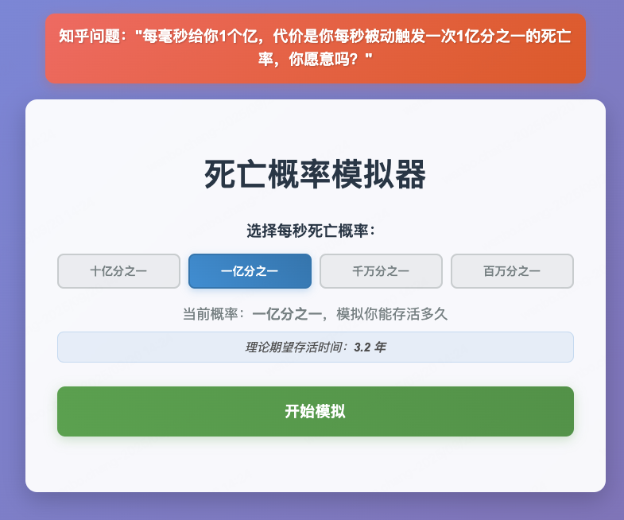
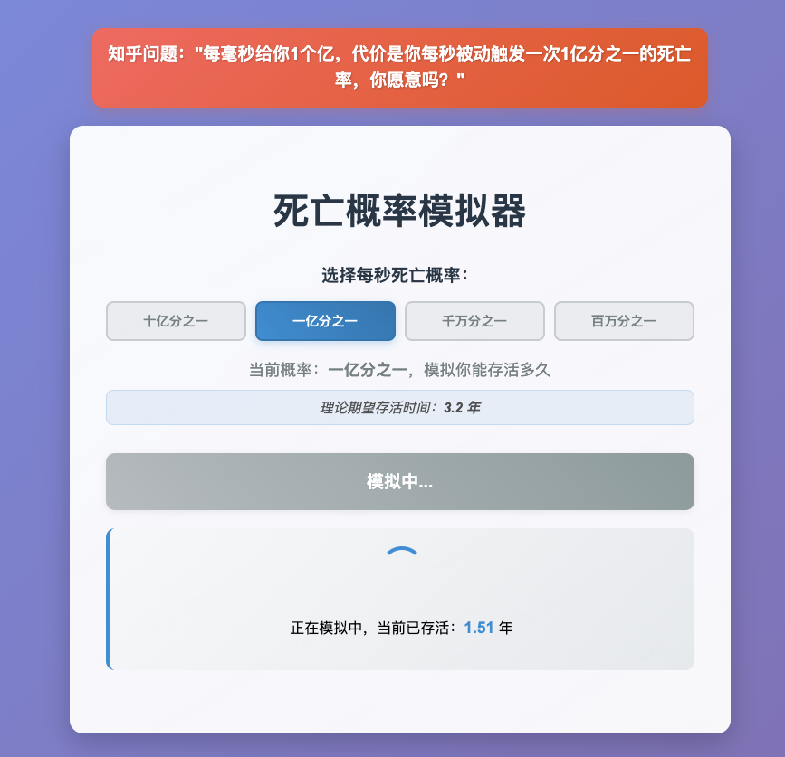
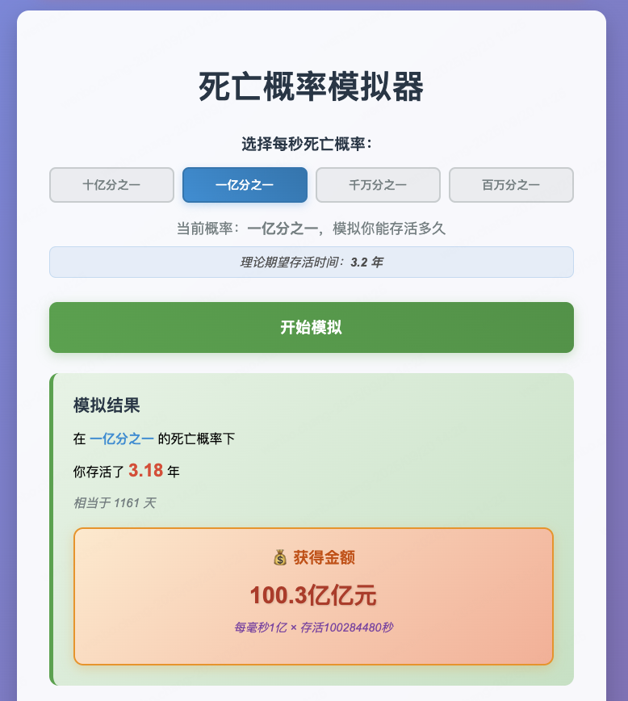

# 🎮 概率与决策互动体验平台

一个基于 Vue 3 的概率与决策互动体验平台，包含多个趣味性与教育性并重的互动项目。

## ✨ 项目特色

### 🎯 核心功能

**导航中心**
- **现代化主页**：卡片式导航设计，一目了然
- **统一风格**：紫色渐变主题贯穿所有页面
- **响应式布局**：完美适配桌面端和移动端
- **平滑切换**：页面间流畅的切换动画

**1️⃣ 死亡概率模拟器 💀**
- **概率选择器**：支持十亿分之一到百万分之一等多种死亡概率
- **实时模拟**：模拟过程中实时显示存活时间
- **几何分布算法**：使用数学方法精确计算
- **收益计算**：按"每毫秒1亿元"计算理论收益

**2️⃣ 风险抉择抽奖 🎰**（新增）
- **双方案对比**：
  - 方案A：100%获得200万（稳定收益）
  - 方案B：99%获得2亿（高风险博弈）
- **多次抽奖**：支持单次、10次、100次抽奖
- **详细统计**：成功率、总收益、期望值对比
- **震撼视觉**：金色粒子动画、数字滚动效果
- **结果展示**：可展开查看每次抽奖详情

**3️⃣ 随机点名器 📝**
- **公平随机**：真随机算法确保公平性
- **自定义名单**：支持导入、编辑学生名单
- **数据持久化**：名单保存在本地存储
- **教学优化**：适合课堂教学场景

### 📊 概率选项（从低到高排列）
- 十亿分之一 (1/1,000,000,000) - 超极低死亡率
- 一亿分之一 (1/100,000,000) - 极低死亡率  
- 千万分之一 (1/10,000,000) - 低死亡率
- 百万分之一 (1/1,000,000) - 中等死亡率

### 🎨 界面设计
- 现代化毛玻璃效果
- 渐变背景和按钮
- 实时状态指示器
- 优雅的动画过渡

## 🛠️ 技术栈

- **前端框架**：Vue 3.2.13（Composition API）
- **构建工具**：Vue CLI 5.0.0
- **开发工具**：Cursor IDE + AI辅助开发
- **样式方案**：原生CSS3 + 渐变效果 + 动画
- **状态管理**：组件内部状态 + Event Emitter
- **路由方案**：自定义页面切换（无需 vue-router）
- **部署方案**：Node.js + Nginx 反向代理

## 📁 项目结构

```
tutong/
├── src/
│   ├── components/
│   │   ├── HomePage.vue          # 主导航页面
│   │   ├── DeathSimulator.vue    # 死亡概率模拟器
│   │   ├── LotteryGame.vue       # 风险抉择抽奖（新增）
│   │   └── RandomNamePicker.vue  # 随机点名器
│   ├── App.vue                    # 根组件（页面路由）
│   ├── main.js                    # 入口文件
│   └── assets/                    # 静态资源
├── vue.config.js                  # 生产环境配置
├── vue.config.local.js            # 本地开发配置
└── package.json                   # 依赖管理
```

## 📖 使用说明

### 主页导航
1. 访问 http://localhost:8080 进入主页
2. 选择你感兴趣的互动项目
3. 点击"进入体验"按钮

### 死亡概率模拟器
1. **选择概率**：点击概率按钮选择每秒死亡概率
2. **开始模拟**：点击"开始模拟"按钮开始生存模拟
3. **观察过程**：实时查看存活时间增长
4. **查看结果**：模拟结束后查看最终存活年数、天数和理论收益

### 风险抉择抽奖
1. **选择方案**：点击方案A（稳定）或方案B（博弈）
2. **选择次数**：选择单次、10次或100次抽奖
3. **开始抽奖**：点击"开始抽奖"按钮
4. **查看结果**：
   - 单次：直接查看中奖结果和金额
   - 多次：查看统计数据、对比分析和详细列表
5. **再来一次**：点击"再来一次"重新选择

### 随机点名器
1. **导入名单**：点击"导入名单"批量导入学生姓名
2. **开始点名**：点击"开始点名"开始随机滚动
3. **停止点名**：再次点击停止并确定选中的人
4. **编辑名单**：鼠标悬停在姓名上可编辑或删除

## 🔬 算法原理

### 死亡概率模拟器
使用**几何分布逆变换采样**方法：
- 公式：`X = ceil(log(U) / log(1-p))`，其中 U ~ Uniform(0,1)
- 期望值：`E[X] = 1/p`
- 相比传统蒙特卡洛方法，性能提升显著

### 风险抉择抽奖
使用**真随机数生成**：
- 方案A：确定性返回200万
- 方案B：生成 [0,1) 区间随机数，< 0.99 则中奖2亿
- 期望值计算：方案A为200万，方案B为1.98亿

### 可视化示例





## 部署发布
1. 将代码传到linux服务器上面
2. 使用node部署，vue的https限制真多，搞了好多才搞定，第一次真心难搞定
3. 配置nginx反向代理
4. 最终发布部署


## 🔗 相关链接

- 📱 [在线体验地址](https://www.gdufe888.top/wt/)
- 💻 [GitHub 仓库](https://github.com/wenbochang888/random-money)


## 👨‍💻 关于作者

- **GitHub**: [@wenbochang888](https://github.com/wenbochang888/random-money)
- **微信公众号**: 《程序员博博》

欢迎关注我的微信公众号，获取更多技术分享和项目更新！


## 🤝 贡献指南

欢迎提交 Issue 和 Pull Request 来帮助改进项目！

## 📄 许可证

本项目采用 MIT 许可证。


## 启动命令

### 本地开发
```bash
npm run serve
# 访问：http://localhost:8080
```

### Linux部署
```bash
nohup npm run prod-dev > /root/logs/vue/dm.log 2>&1 &
# 验证nginx: /usr/local/nginx/sbin/nginx -t
# 重载nginx: /usr/local/nginx/sbin/nginx -s reload
```